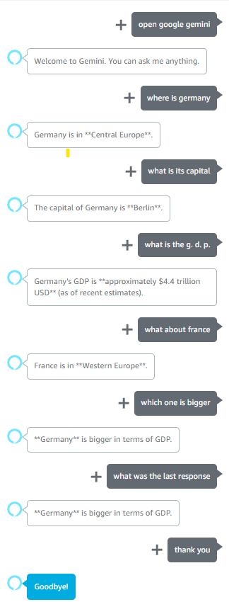

# Alexa-Gemini Conversational Skill

This project is an advanced Alexa skill that uses Google's Gemini AI for intelligent, conversational responses. It maintains session-based chat history to provide context-aware answers, all built on a robust, asynchronous AWS Serverless backend.

## Features

- **Conversational AI with Google Gemini**: Leverages the power of Google's Gemini models for fluid and intelligent conversation.
- **Session-Based History**: Remembers the context of the current conversation for more natural follow-up questions.
- **Asynchronous Architecture**: An SQS queue and a worker Lambda prevent the skill from timing out while waiting for long-running AI responses.
- **Built-in Commands**: Includes logic for handling commands like "help" and retrieving the last response if the user had to wait.

## How to Use

You can start the skill by saying, "Alexa, open google gemini." The invocation name ("google gemini") is defined in `skill.json` and can be customized in the Alexa Developer Console. 

Once the skill is open, you can ask your questions directly. The skill maintains conversation history, so after receiving a response, you can ask follow-up questions naturally.

- **Getting Help**: If you need assistance, just say `help`.
- **Ending the Session**: To end the conversation, you can say `no` or `thank you`, or use the standard "stop" command.
- **Retrieving a Delayed Response**: If a response from the AI takes a long time, the skill will notify you. You can then retrieve the answer by saying phrases like:
  - "last response"
  - "what was the last response"
  - "what did you say"
  - "get the answer"
  - "i am waiting"



## Architecture Flow

The project uses a decoupled, event-driven architecture:

1.  **User Request**: The user speaks to Alexa, triggering the primary Lambda function (`alexa/index.js`).
2.  **Queueing**: This Lambda sends a message with the user's prompt and session data to an AWS SQS queue. This avoids the 8-second Alexa timeout.
3.  **Backend Processing**: A second Lambda function (`sqs/index.js`) is triggered by the SQS message.
4.  **AI Interaction**: This worker Lambda retrieves conversation history from DynamoDB, calls the Google Gemini API, and gets the new response.
5.  **State Persistence**: The worker stores the new AI response and the updated conversation history back into a DynamoDB table.
6.  **Response Retrieval**: The user can retrieve the response at any time by asking for the "last response".

## Project Structure

```
.aws-sam/         # (Generated by 'sam build', ignored by Git)
alexa/             # Source for the primary Alexa interface Lambda
sqs/               # Source for the SQS worker Lambda (calls Gemini)
.gitignore         # Specifies files to be ignored by Git
samconfig.toml     # SAM CLI deployment configuration
skill.json         # The Alexa skill interaction model definition
template.yaml      # AWS SAM template defining all cloud resources
README.md          # This file
```

## Prerequisites

- An AWS Account
- [AWS CLI](https://aws.amazon.com/cli/) configured on your machine
- [AWS SAM CLI](https://docs.aws.amazon.com/serverless-application-model/latest/developerguide/serverless-sam-cli-install.html) installed
- [Node.js](https://nodejs.org/) (v20.x or later)
- A **Google AI Studio API Key** for the Gemini API. You can get one from [Google AI Studio](https://aistudio.google.com/).

## Installation and Deployment

1.  **Clone the Repository**: `git clone <your-repo-url>`
2.  **Navigate to Directory**: `cd <project-directory>`
3.  **Build the Project**: Run the SAM build command:
    ```sh
    sam build
    ```
4.  **Deploy to AWS**: Deploy the application using the guided deployment process:
    ```sh
    sam deploy --guided
    ```
5.  **Enter Parameters**: During the guided deployment, SAM will prompt you for parameters. For `GeminiApiKey`, paste your key from Google AI Studio. Accept the defaults for the other parameters.
6.  **Configure Alexa Endpoint**: After deployment is complete, the SAM CLI will output the ARN of the `ChatGPTFunction`. Copy this ARN.
7.  Go to the [Alexa Developer Console](https://developer.amazon.com/alexa/console/ask) and create a new skill.
8.  In your skill's configuration, navigate to the **Endpoint** section and paste the Lambda ARN you copied.
9.  **Define the Interaction Model**: Navigate to the **JSON Editor** section (under Interaction Model). Open the `skill.json` file from this project, copy its entire contents, and paste it into the editor. Save the model.